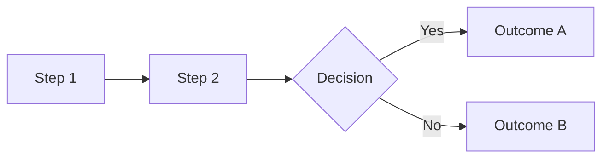

# Phase 2: GENERATE

Transform the approved outline into full Slidev markdown content.

## Prerequisites

- Approved `presentation-outline.yaml` from Phase 1
- Template selection (default: stakeholder-briefing)
- Theme preference (default: default)

## Process

### Step 1: Load Template

Select and load the appropriate template:

```bash
# Available templates
templates/
├── _base.md                 # Minimal structure
├── stakeholder-briefing.md  # Executive presentations
└── technical-deep-dive.md   # Technical audiences
```

Template selection criteria:
- **stakeholder-briefing**: Non-technical audience, approval-focused, leave-behinds
- **technical-deep-dive**: Developer audience, code blocks, architecture diagrams
- **_base**: Custom presentations not fitting other templates

### Step 2: Expand Outline to Slides

For each entry in the outline, generate full slide content:

```markdown
---
layout: default
---

# [Slide Title from Outline]

<div class="[appropriate-layout]">

[Expanded content from key_points]

</div>

<!--
Speaker Notes:
[notes from outline]
-->
```

### Step 3: Add Visual Elements

Based on `visual` field in outline:

| Visual Type | Implementation |
|-------------|----------------|
| `diagram` | Mermaid flowchart or mindmap |
| `chart` | Mermaid pie/bar or custom SVG |
| `screenshot` | Placeholder with instructions |
| `code` | Syntax-highlighted code block |
| `table` | Markdown table |
| `none` | Text-only slide |

**Mermaid Example**:
```markdown

```

### Step 4: Apply Slidev Features

Enhance slides with Slidev capabilities:

```markdown
<!-- Progressive reveal -->
<v-clicks>

- Point 1
- Point 2
- Point 3

</v-clicks>

<!-- Two-column layout -->
<div class="grid grid-cols-2 gap-4">
<div>

Left content

</div>
<div>

Right content

</div>
</div>

<!-- Highlighting -->
<span class="text-yellow-400 font-bold">Emphasized text</span>
```

### Step 5: Add Frontmatter

Complete the presentation frontmatter:

```yaml
---
theme: default
title: "[Title from outline]"
info: |
  [Description]

  Created with presentation-forge
author: "[Author]"
keywords: [keyword1, keyword2]
exportFilename: "[filename]-export"
---
```

### Step 6: Content Guidelines

**DO**:
- Keep slides scannable (max 6 bullet points)
- Use consistent terminology
- Include speaker notes for every slide
- Add v-clicks for sequential reveal
- Use appropriate visual hierarchy

**DON'T**:
- Overflow content (will be caught in VALIDATE)
- Use complex Mermaid diagrams that don't render well
- Include more than 30 slides for 30-minute presentation
- Forget section dividers

## Output

- `slides.md` - Complete Slidev presentation
- Ready for Phase 3 (VALIDATE)

## Quality Checklist

Before proceeding to VALIDATE:

- [ ] All outline sections converted to slides
- [ ] Frontmatter complete
- [ ] Speaker notes added
- [ ] Visual elements appropriate
- [ ] Slide count within bounds

## Next Phase

Proceed to [Phase 3: VALIDATE](./validate.md)
