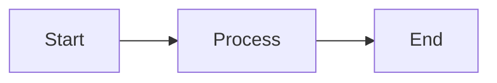

# {{TITLE}}

{{SUBTITLE}}

{{AUTHOR}} · {{DATE}}

---

# Agenda

<v-clicks>

- Section 1
- Section 2
- Section 3

</v-clicks>

---
layout: section
---

# Section 1

---

# Slide Title

Content goes here.

<v-clicks>

- Point 1
- Point 2
- Point 3

</v-clicks>

<!--
Speaker notes for this slide.
Key points to emphasize:
- Note 1
- Note 2
-->

---
layout: section
---

# Section 2

---

# Another Slide

## Left Column

Content for left side.

## Right Column

Content for right side.

---

# Diagram Example

---
layout: section
---

# Summary

---

# Key Takeaways

<v-clicks>

1. **Takeaway 1**: Description
2. **Takeaway 2**: Description
3. **Takeaway 3**: Description

</v-clicks>

---
layout: center
class: text-center
---

# Questions?

Contact: {{EMAIL}}

<!--
Q&A Notes:
- Anticipated question 1: Answer approach
- Anticipated question 2: Answer approach
-->
