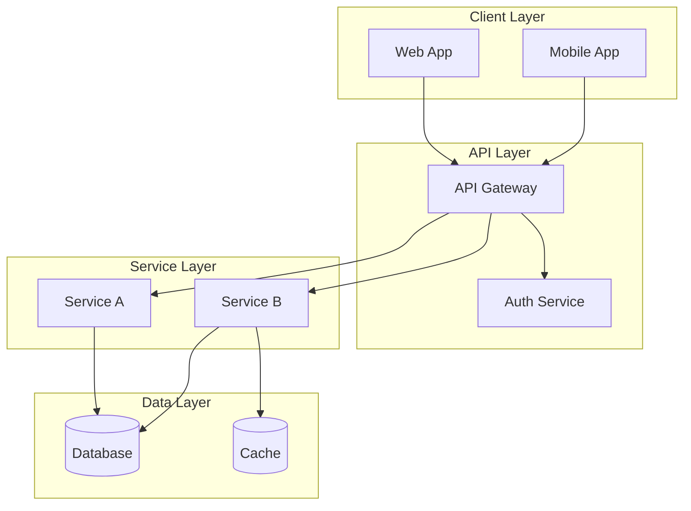
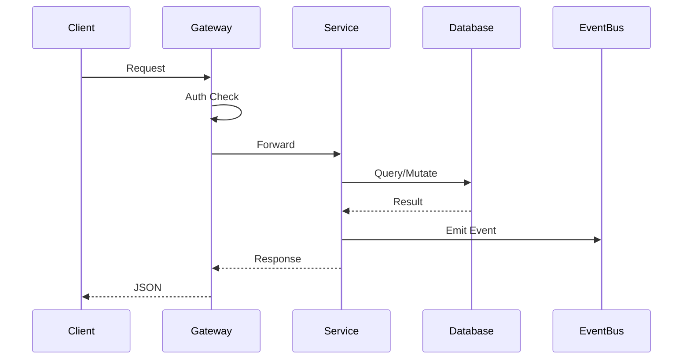
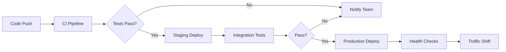

# {{TITLE}}

{{SUBTITLE}}

<div class="absolute bottom-10 left-10 text-sm opacity-60">
{{AUTHOR}} · {{DATE}} · Multi-Stakeholder Briefing
</div>

---

# Agenda

<div class="grid grid-cols-3 gap-4 mt-8">
<div class="p-4 bg-blue-900/30 rounded-lg">

### Part 1: Executive Overview
🎯 *For: Leadership*

- Strategic Context
- Key Decisions
- Business Impact

</div>
<div class="p-4 bg-green-900/30 rounded-lg">

### Part 2: Technical Deep Dive
🔧 *For: Engineering*

- Architecture
- Implementation
- Code Patterns

</div>
<div class="p-4 bg-purple-900/30 rounded-lg">

### Part 3: Operations
🚀 *For: DevOps/SRE*

- Deployment
- Monitoring
- Support Model

</div>
</div>

<!--
Presenter Note: This is a hybrid presentation. 
- Parts have different target audiences
- Executives may leave after Part 1
- Technical teams join for Parts 2-3
-->

---
layout: section
---

# Part 1: Executive Overview

<div class="text-2xl mt-4">
🎯 Target Audience: Leadership & Decision Makers
</div>

---

# 30-Second Summary

<div class="grid grid-cols-3 gap-6 mt-8">
<div class="p-4 bg-green-900/30 rounded-lg border-l-4 border-green-500">

### ✅ Done
{{DONE_SUMMARY}}

</div>
<div class="p-4 bg-red-900/30 rounded-lg border-l-4 border-red-500">

### 🚫 Blocker
{{BLOCKER_SUMMARY}}

</div>
<div class="p-4 bg-yellow-900/30 rounded-lg border-l-4 border-yellow-500">

### 💬 Ask
{{ASK_SUMMARY}}

</div>
</div>

<div class="mt-8 text-center text-lg opacity-80">

*If you remember nothing else from this meeting...*

</div>

---

# Strategic Context

{{STRATEGIC_CONTEXT}}

<v-clicks>

- **Business Driver**: {{BUSINESS_DRIVER}}
- **Timeline Pressure**: {{TIMELINE_PRESSURE}}
- **Risk if Delayed**: {{DELAY_RISK}}

</v-clicks>

---

# Decision Required

<div class="p-6 bg-yellow-900/30 rounded-lg border-2 border-yellow-500 mt-8">

### {{DECISION_TITLE}}

{{DECISION_DESCRIPTION}}

<div class="grid grid-cols-2 gap-4 mt-4">
<div class="p-3 bg-gray-800 rounded">

**Option A**: {{OPTION_A}}

</div>
<div class="p-3 bg-blue-900/40 rounded border border-blue-500">

**Option B** ⭐: {{OPTION_B}} *(Recommended)*

</div>
</div>

</div>

<!--
PAUSE HERE for executive decision
Do not proceed to Part 2 until alignment achieved
-->

---

# Business Impact

| Metric | Before | After | Change |
|--------|--------|-------|--------|
| {{METRIC_1}} | {{BEFORE_1}} | {{AFTER_1}} | {{CHANGE_1}} |
| {{METRIC_2}} | {{BEFORE_2}} | {{AFTER_2}} | {{CHANGE_2}} |
| {{METRIC_3}} | {{BEFORE_3}} | {{AFTER_3}} | {{CHANGE_3}} |

<div class="mt-4 p-3 bg-green-900/30 rounded">

**ROI Summary**: {{ROI_SUMMARY}}

</div>

---

# Executive Summary

<v-clicks>

1. **What**: {{EXEC_WHAT}}
2. **Why**: {{EXEC_WHY}}
3. **When**: {{EXEC_WHEN}}
4. **Ask**: {{EXEC_ASK}}

</v-clicks>

<div class="mt-8 text-center">

*Executives may depart - Technical deep dive follows*

</div>

---
layout: section
---

# Part 2: Technical Deep Dive

<div class="text-2xl mt-4">
🔧 Target Audience: Engineering Team
</div>

---

# Architecture Overview



---

# Key Technical Decisions

<div class="grid grid-cols-2 gap-6">
<div>

## Architecture Decisions

<v-clicks>

- **ADR-001**: {{ADR_1_TITLE}}
- **ADR-002**: {{ADR_2_TITLE}}
- **ADR-003**: {{ADR_3_TITLE}}

</v-clicks>

</div>
<div>

## Technology Stack

- **Frontend**: {{FRONTEND_TECH}}
- **Backend**: {{BACKEND_TECH}}
- **Database**: {{DATABASE_TECH}}
- **Infrastructure**: {{INFRA_TECH}}

</div>
</div>

---

# Implementation Pattern

```typescript {all|1-8|10-20}
// Core service pattern
interface {{SERVICE_NAME}}Service {
  create(data: CreateDTO): Promise<Result<Entity>>;
  find(query: QueryParams): Promise<Result<Entity[]>>;
  update(id: string, data: UpdateDTO): Promise<Result<Entity>>;
  delete(id: string): Promise<Result<void>>;
}

// Implementation with dependency injection
class {{SERVICE_NAME}}ServiceImpl implements {{SERVICE_NAME}}Service {
  constructor(
    private readonly repository: Repository<Entity>,
    private readonly eventBus: EventBus,
    private readonly logger: Logger
  ) {}

  async create(data: CreateDTO): Promise<Result<Entity>> {
    // Validation, creation, event emission
  }
}
```

---

# Data Flow



---

# Performance Considerations

| Concern | Mitigation | Status |
|---------|------------|--------|
| {{PERF_CONCERN_1}} | {{PERF_MITIGATION_1}} | {{PERF_STATUS_1}} |
| {{PERF_CONCERN_2}} | {{PERF_MITIGATION_2}} | {{PERF_STATUS_2}} |
| {{PERF_CONCERN_3}} | {{PERF_MITIGATION_3}} | {{PERF_STATUS_3}} |

---
layout: section
---

# Part 3: Operations

<div class="text-2xl mt-4">
🚀 Target Audience: DevOps & SRE
</div>

---

# Deployment Strategy



---

# Infrastructure Requirements

<div class="grid grid-cols-2 gap-6">
<div>

## Compute

- **Type**: {{COMPUTE_TYPE}}
- **Sizing**: {{COMPUTE_SIZE}}
- **Scaling**: {{SCALING_STRATEGY}}

</div>
<div>

## Dependencies

- **Database**: {{DB_REQUIREMENTS}}
- **Cache**: {{CACHE_REQUIREMENTS}}
- **Queue**: {{QUEUE_REQUIREMENTS}}

</div>
</div>

---

# Monitoring & Alerts

| Metric | Threshold | Alert Channel |
|--------|-----------|---------------|
| Error Rate | > 1% | {{ALERT_CHANNEL}} |
| Latency P99 | > 500ms | {{ALERT_CHANNEL}} |
| CPU Usage | > 80% | {{ALERT_CHANNEL}} |

<div class="mt-6">

**Dashboards**: {{DASHBOARD_LINKS}}

**Runbooks**: {{RUNBOOK_LINKS}}

</div>

---

# Support Model

<div class="grid grid-cols-3 gap-4">
<div class="p-4 bg-gray-800 rounded-lg">

### L1: On-Call
- Alert response
- Basic triage
- Escalation

</div>
<div class="p-4 bg-gray-800 rounded-lg">

### L2: Engineering
- Investigation
- Hot fixes
- Coordination

</div>
<div class="p-4 bg-gray-800 rounded-lg">

### L3: Architecture
- Root cause
- Design changes
- Post-mortems

</div>
</div>

---
layout: section
---

# Next Steps & Actions

---

# Action Items

| Action | Owner | Due | Audience |
|--------|-------|-----|----------|
| {{ACTION_1}} | {{OWNER_1}} | {{DUE_1}} | Executive |
| {{ACTION_2}} | {{OWNER_2}} | {{DUE_2}} | Engineering |
| {{ACTION_3}} | {{OWNER_3}} | {{DUE_3}} | DevOps |

<div class="mt-6 p-4 bg-blue-900/30 rounded-lg">

**Follow-up Meetings**:
- Executive Review: {{EXEC_FOLLOWUP}}
- Technical Sync: {{TECH_FOLLOWUP}}
- Ops Readiness: {{OPS_FOLLOWUP}}

</div>

---
layout: center
class: text-center
---

# Questions?

<div class="grid grid-cols-3 gap-8 mt-8 text-sm">
<div>

**Executive Questions**
Strategic, business impact

</div>
<div>

**Technical Questions**
Architecture, implementation

</div>
<div>

**Ops Questions**
Deployment, monitoring

</div>
</div>

<div class="mt-8 opacity-60">

{{AUTHOR}} · {{EMAIL}}

</div>
