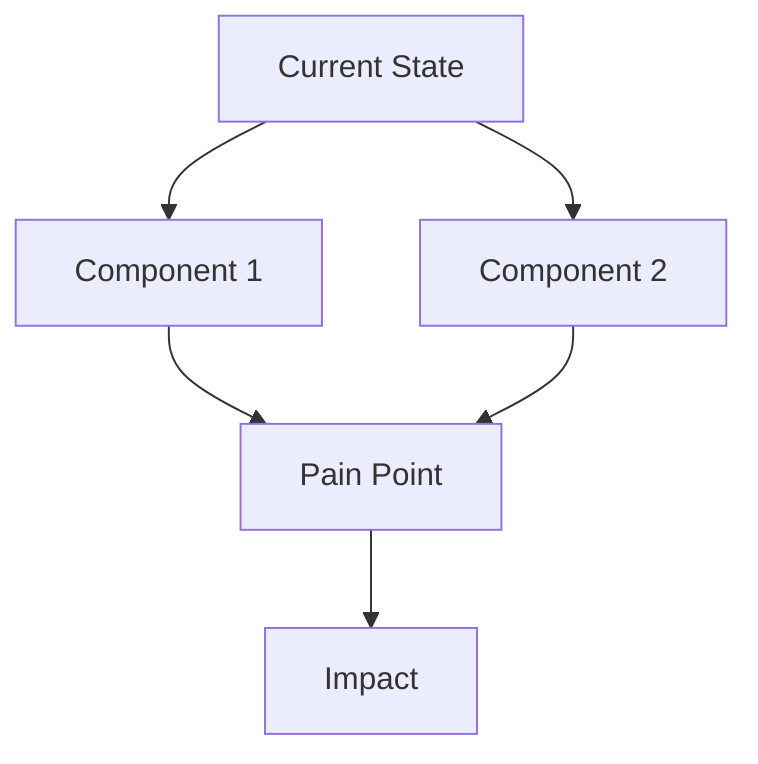
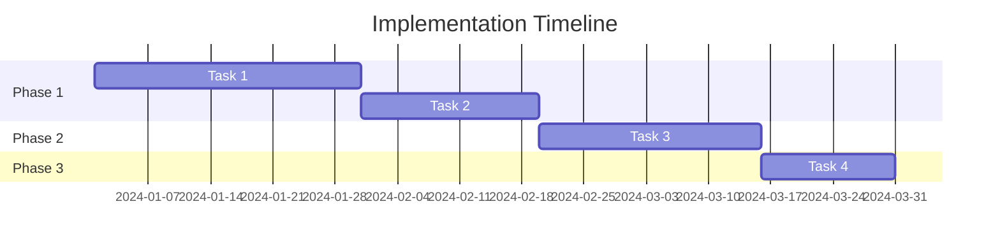

# {{TITLE}}

{{SUBTITLE}}

{{AUTHOR}} · {{DATE}} · Stakeholder Briefing

---

# Agenda

## Today's Focus

<v-clicks>

- Context & Background
- Current State
- Proposed Approach
- Decision Points
- Next Steps

</v-clicks>

## Meeting Goals

<v-clicks>

- Align on direction
- Gather feedback
- Secure approvals
- Define action items

</v-clicks>

<!--
Timing: 3 minutes
Set expectations for the meeting format
-->

---
layout: section
---

# Context & Background

Why are we here today?

---

# The Challenge

{{CHALLENGE_DESCRIPTION}}

### Impact 1
{{IMPACT_1}}

### Impact 2
{{IMPACT_2}}

### Impact 3
{{IMPACT_3}}

<!--
Speaker Notes:
- Establish urgency without creating panic
- Reference specific metrics or incidents
-->

---

# What We've Learned

<v-clicks>

- **Discovery 1**: Insight and implication
- **Discovery 2**: Insight and implication
- **Discovery 3**: Insight and implication

</v-clicks>

**Key Insight**: {{KEY_INSIGHT}}

---
layout: section
---

# Current State

Where we are today

---

# Current Architecture/Process

<!--
Speaker Notes:
- Walk through the current state diagram
- Highlight pain points explicitly
-->

---

# Gap Analysis

| Area | Current | Target | Gap |
|------|---------|--------|-----|
| {{AREA_1}} | {{CURRENT_1}} | {{TARGET_1}} | {{GAP_1}} |
| {{AREA_2}} | {{CURRENT_2}} | {{TARGET_2}} | {{GAP_2}} |
| {{AREA_3}} | {{CURRENT_3}} | {{TARGET_3}} | {{GAP_3}} |

⚠️ **Risk if unaddressed**: {{RISK_STATEMENT}}

---
layout: section
---

# Proposed Approach

Our recommended path forward

---

# Strategic Options

### Option A
{{OPTION_A_NAME}}

<v-click>

**Pros**:
- Pro 1
- Pro 2

**Cons**:
- Con 1

</v-click>

### Option B ⭐
{{OPTION_B_NAME}}

<v-click>

**Pros**:
- Pro 1
- Pro 2

**Cons**:
- Con 1

**Recommended**

</v-click>

### Option C
{{OPTION_C_NAME}}

<v-click>

**Pros**:
- Pro 1
- Pro 2

**Cons**:
- Con 1

</v-click>

<!--
Speaker Notes:
- Present all options fairly
- Explain why Option B is recommended
- Be prepared for questions on each
-->

---

# Recommended Approach: {{OPTION_B_NAME}}

## What We'll Do

<v-clicks>

1. Phase 1: {{PHASE_1}}
2. Phase 2: {{PHASE_2}}
3. Phase 3: {{PHASE_3}}

</v-clicks>

## Expected Outcomes

<v-clicks>

- ✅ {{OUTCOME_1}}
- ✅ {{OUTCOME_2}}
- ✅ {{OUTCOME_3}}

</v-clicks>

---

# Timeline Overview

---
layout: section
---

# Decision Points

🔐 Approval Checkpoint

---

# Decisions Needed Today

### Decision 1: {{DECISION_1_TITLE}}

{{DECISION_1_DESCRIPTION}}

**Options**: A) {{DECISION_1_A}} | B) {{DECISION_1_B}}

### Decision 2: {{DECISION_2_TITLE}}

{{DECISION_2_DESCRIPTION}}

**Options**: A) {{DECISION_2_A}} | B) {{DECISION_2_B}}

<!--
Speaker Notes:
- Pause here for discussion
- Capture decisions explicitly
- Don't proceed until alignment achieved
-->

---
layout: section
---

# Next Steps

Concrete actions and owners

---

# Immediate Actions

| Action | Owner | Due Date | Status |
|--------|-------|----------|--------|
| {{ACTION_1}} | {{OWNER_1}} | {{DUE_1}} | 🔲 Pending |
| {{ACTION_2}} | {{OWNER_2}} | {{DUE_2}} | 🔲 Pending |
| {{ACTION_3}} | {{OWNER_3}} | {{DUE_3}} | 🔲 Pending |

**Next Meeting**: {{NEXT_MEETING_DATE}} - {{NEXT_MEETING_PURPOSE}}

---

# Summary

<v-clicks>

1. **The Challenge**: {{SUMMARY_CHALLENGE}}
2. **Our Recommendation**: {{SUMMARY_RECOMMENDATION}}
3. **Key Decision**: {{SUMMARY_DECISION}}
4. **Next Step**: {{SUMMARY_NEXT_STEP}}

</v-clicks>

---
layout: center
class: text-center
---

# Questions & Discussion

Thank you for your time and attention.

{{AUTHOR}} · {{EMAIL}}

<!--
Q&A Preparation:
- Anticipated Q1: {{Q1}} → Answer: {{A1}}
- Anticipated Q2: {{Q2}} → Answer: {{A2}}
- Anticipated Q3: {{Q3}} → Answer: {{A3}}
-->
