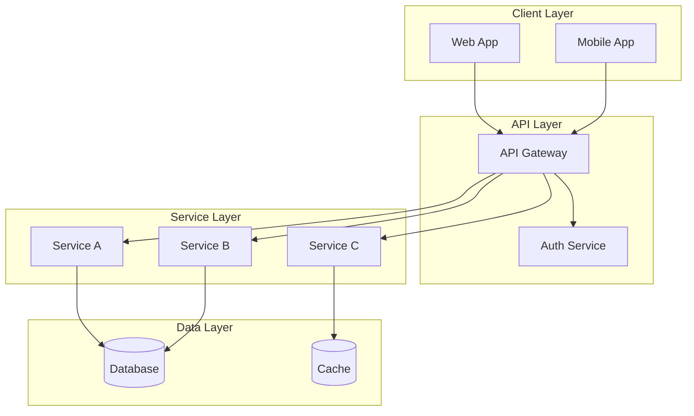
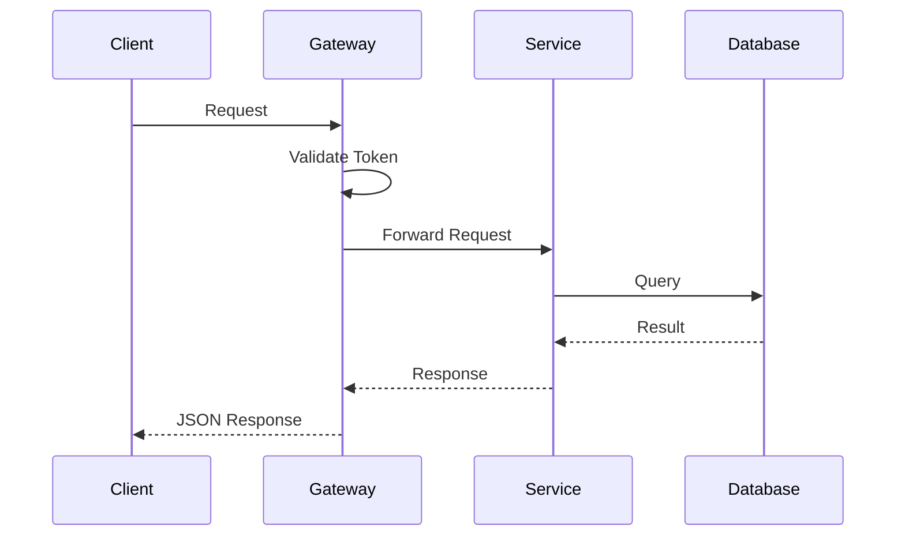
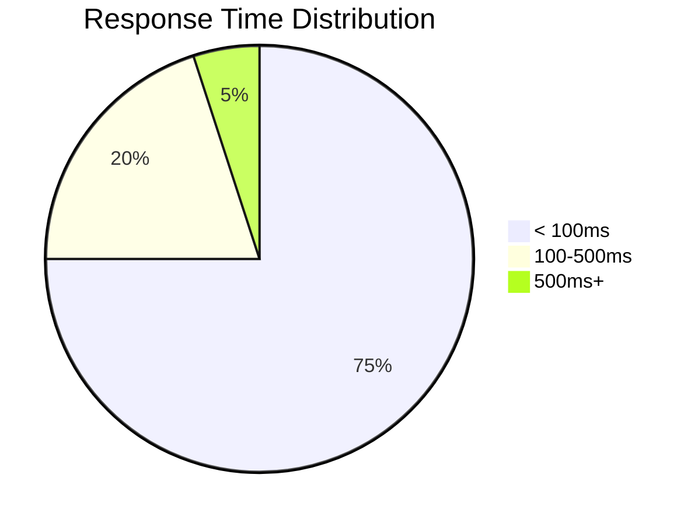

# {{TITLE}}

{{SUBTITLE}}

<div class="absolute bottom-10 left-10 text-sm opacity-60">
{{AUTHOR}} · {{DATE}} · Technical Deep Dive
</div>

---

# Agenda

<div class="grid grid-cols-2 gap-8">
<div>

## Topics

<v-clicks>

- Architecture Overview
- Implementation Details
- Code Walkthrough
- Performance Considerations
- Q&A / Discussion

</v-clicks>

</div>
<div>

## Prerequisites

- Familiarity with {{PREREQ_1}}
- Understanding of {{PREREQ_2}}
- Access to {{PREREQ_3}}

</div>
</div>

---
layout: section
---

# Architecture Overview

The big picture

---

# System Architecture



---

# Key Components

<div class="grid grid-cols-2 gap-6">
<div>

## {{COMPONENT_1}}

**Purpose**: {{PURPOSE_1}}

**Technology**: {{TECH_1}}

**Key Features**:
- Feature 1
- Feature 2

</div>
<div>

## {{COMPONENT_2}}

**Purpose**: {{PURPOSE_2}}

**Technology**: {{TECH_2}}

**Key Features**:
- Feature 1
- Feature 2

</div>
</div>

---
layout: section
---

# Implementation Details

How it works under the hood

---

# Data Flow



---

# Core Implementation

```typescript {all|1-5|7-12|14-18}
// Service interface
interface DataService {
  fetch(id: string): Promise<Data>;
  create(data: CreateDTO): Promise<Data>;
}

// Implementation
class DataServiceImpl implements DataService {
  constructor(private db: Database) {}

  async fetch(id: string): Promise<Data> {
    return this.db.findById(id);
  }

  async create(data: CreateDTO): Promise<Data> {
    const validated = await this.validate(data);
    return this.db.insert(validated);
  }
}
```

<!--
Code walkthrough:
- Lines 1-5: Interface definition
- Lines 7-12: Constructor and fetch
- Lines 14-18: Create with validation
-->

---

# Error Handling Pattern

```typescript
// Result type for explicit error handling
type Result<T, E = Error> =
  | { success: true; data: T }
  | { success: false; error: E };

// Usage
async function fetchData(id: string): Promise<Result<Data>> {
  try {
    const data = await service.fetch(id);
    return { success: true, data };
  } catch (error) {
    logger.error('Fetch failed', { id, error });
    return { success: false, error };
  }
}
```

<div class="mt-4 p-3 bg-green-900/30 rounded">

✅ **Why this pattern?** Explicit error handling, no silent failures

</div>

---

# Configuration

```yaml
# config.yaml
service:
  name: {{SERVICE_NAME}}
  port: 3000

database:
  host: ${DB_HOST}
  port: 5432
  pool:
    min: 2
    max: 10

cache:
  enabled: true
  ttl: 3600

logging:
  level: info
  format: json
```

---
layout: section
---

# Performance Considerations

Optimization strategies

---

# Benchmarks

| Operation | Before | After | Improvement |
|-----------|--------|-------|-------------|
| {{OP_1}} | {{BEFORE_1}} | {{AFTER_1}} | {{IMPROVE_1}} |
| {{OP_2}} | {{BEFORE_2}} | {{AFTER_2}} | {{IMPROVE_2}} |
| {{OP_3}} | {{BEFORE_3}} | {{AFTER_3}} | {{IMPROVE_3}} |

<div class="mt-6">



</div>

---

# Optimization Techniques

<div class="grid grid-cols-2 gap-6">
<div>

## Implemented

<v-clicks>

- ✅ Connection pooling
- ✅ Query optimization
- ✅ Response caching
- ✅ Lazy loading

</v-clicks>

</div>
<div>

## Planned

<v-clicks>

- 🔲 Read replicas
- 🔲 CDN integration
- 🔲 Async processing
- 🔲 Rate limiting

</v-clicks>

</div>
</div>

---

# Memory Profile

```
┌─────────────────────────────────────┐
│ Heap Usage Over Time                │
├─────────────────────────────────────┤
│                    ╭───╮            │
│              ╭─────╯   ╰────╮       │
│         ╭────╯              ╰───╮   │
│    ╭────╯                       │   │
│ ───╯                            ╰── │
├─────────────────────────────────────┤
│ 0h    1h    2h    3h    4h    5h    │
└─────────────────────────────────────┘
Peak: 512MB | Avg: 256MB | Min: 128MB
```

---
layout: section
---

# Demo / Walkthrough

Live demonstration

---

# Demo: {{DEMO_TITLE}}

<div class="grid grid-cols-2 gap-4">
<div>

## Steps

1. {{DEMO_STEP_1}}
2. {{DEMO_STEP_2}}
3. {{DEMO_STEP_3}}
4. {{DEMO_STEP_4}}

</div>
<div>

## Expected Output

```json
{
  "status": "success",
  "data": {
    "id": "abc123",
    "created": "2024-01-15"
  }
}
```

</div>
</div>

<!--
Demo Notes:
- Have fallback screenshots ready
- Test connection before presenting
-->

---
layout: section
---

# Summary & Next Steps

---

# Key Takeaways

<v-clicks>

1. **Architecture**: {{TAKEAWAY_1}}
2. **Implementation**: {{TAKEAWAY_2}}
3. **Performance**: {{TAKEAWAY_3}}

</v-clicks>

<div class="mt-8 p-4 bg-blue-900/30 rounded-lg">

📚 **Documentation**: {{DOCS_LINK}}

🔗 **Repository**: {{REPO_LINK}}

</div>

---

# Resources

<div class="grid grid-cols-2 gap-8">
<div>

## Documentation

- [API Reference]({{API_DOCS}})
- [Architecture Guide]({{ARCH_DOCS}})
- [Runbooks]({{RUNBOOKS}})

</div>
<div>

## Support

- Slack: {{SLACK_CHANNEL}}
- On-call: {{ONCALL_ROTATION}}
- Issues: {{ISSUE_TRACKER}}

</div>
</div>

---
layout: center
class: text-center
---

# Questions?

<div class="mt-8">

Let's discuss implementation details, edge cases, or alternatives.

</div>

<div class="mt-4 opacity-60">

{{AUTHOR}} · {{EMAIL}}

</div>
