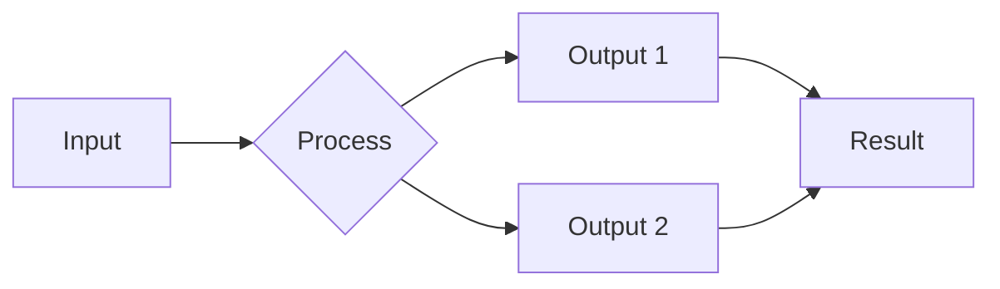

# {{TITLE}}

{{SUBTITLE}}

<div class="absolute bottom-10 left-10 text-sm opacity-60">
{{AUTHOR}} · {{DATE}} · Interactive Workshop
</div>

---

# Workshop Overview

<div class="grid grid-cols-3 gap-6 mt-8">
<div class="p-4 bg-purple-900/30 rounded-lg">

### Duration
{{DURATION}}

</div>
<div class="p-4 bg-blue-900/30 rounded-lg">

### Format
{{FORMAT}}

</div>
<div class="p-4 bg-green-900/30 rounded-lg">

### Participants
{{PARTICIPANT_COUNT}}

</div>
</div>

<div class="mt-8">

**What you'll learn:**

<v-clicks>

- {{LEARNING_OBJECTIVE_1}}
- {{LEARNING_OBJECTIVE_2}}
- {{LEARNING_OBJECTIVE_3}}

</v-clicks>

</div>

---

# Agenda

| Time | Activity | Type |
|------|----------|------|
| {{TIME_1}} | {{ACTIVITY_1}} | {{TYPE_1}} |
| {{TIME_2}} | {{ACTIVITY_2}} | {{TYPE_2}} |
| {{TIME_3}} | {{ACTIVITY_3}} | {{TYPE_3}} |
| {{TIME_4}} | {{ACTIVITY_4}} | {{TYPE_4}} |
| {{TIME_5}} | {{ACTIVITY_5}} | {{TYPE_5}} |

<div class="mt-6 text-sm opacity-80">

*Types: 📚 Lecture | 🛠️ Hands-on | 💬 Discussion | ☕ Break*

</div>

---

# Prerequisites & Setup

<div class="grid grid-cols-2 gap-6">
<div>

## Required

- ✅ {{PREREQ_1}}
- ✅ {{PREREQ_2}}
- ✅ {{PREREQ_3}}

</div>
<div>

## Nice to Have

- 🎯 {{NICE_1}}
- 🎯 {{NICE_2}}
- 🎯 {{NICE_3}}

</div>
</div>

<div class="mt-8 p-4 bg-yellow-900/30 rounded-lg border-l-4 border-yellow-500">

**Setup Check**: Please verify your environment now. Raise hand if you need help.

```bash
{{SETUP_VERIFICATION_COMMAND}}
```

</div>

---
layout: section
---

# Part 1: Foundation

📚 *Lecture + Demo*

---

# {{CONCEPT_1_TITLE}}

{{CONCEPT_1_DESCRIPTION}}

<v-clicks>

- **Key Point 1**: {{POINT_1}}
- **Key Point 2**: {{POINT_2}}
- **Key Point 3**: {{POINT_3}}

</v-clicks>

<!--
Facilitator Notes:
- Spend ~5 minutes on this concept
- Use the whiteboard for additional diagrams
- Check for questions before moving on
-->

---

# Visual: {{CONCEPT_1_TITLE}}



<div class="mt-4">

**Discussion Prompt**: {{DISCUSSION_PROMPT_1}}

</div>

---
layout: section
---

# Activity 1: {{ACTIVITY_1_TITLE}}

🛠️ *Hands-on Exercise ({{ACTIVITY_1_DURATION}})*

---

# Activity 1 Instructions

<div class="grid grid-cols-2 gap-6">
<div>

## Your Task

<v-clicks>

1. {{STEP_1}}
2. {{STEP_2}}
3. {{STEP_3}}
4. {{STEP_4}}

</v-clicks>

</div>
<div>

## Success Criteria

- ✅ {{CRITERIA_1}}
- ✅ {{CRITERIA_2}}
- ✅ {{CRITERIA_3}}

</div>
</div>

<div class="mt-6 p-4 bg-blue-900/30 rounded-lg">

**Timer**: {{ACTIVITY_1_DURATION}} starting NOW

</div>

<!--
Facilitator Notes:
- Walk around and help participants who are stuck
- Common issues: {{COMMON_ISSUES}}
- Have solution ready to show at end
-->

---

# Activity 1: Debrief

<div class="grid grid-cols-2 gap-6">
<div>

## What Worked?

💬 *Open discussion*

</div>
<div>

## Challenges?

💬 *What surprised you?*

</div>
</div>

<div class="mt-8 p-4 bg-green-900/30 rounded-lg">

**Key Insight**: {{ACTIVITY_1_INSIGHT}}

</div>

---
layout: section
---

# Part 2: Advanced Concepts

📚 *Lecture + Demo*

---

# {{CONCEPT_2_TITLE}}

{{CONCEPT_2_DESCRIPTION}}

```{{CODE_LANGUAGE}}
{{CODE_EXAMPLE}}
```

<v-clicks>

- Line 1-3: {{EXPLANATION_1}}
- Line 4-6: {{EXPLANATION_2}}
- Line 7-10: {{EXPLANATION_3}}

</v-clicks>

---

# Live Demo: {{DEMO_TITLE}}

<div class="grid grid-cols-2 gap-4">
<div>

## What We'll Build

{{DEMO_DESCRIPTION}}

**Expected Result:**
- {{EXPECTED_1}}
- {{EXPECTED_2}}

</div>
<div>

## Watch For

- 👀 {{WATCH_FOR_1}}
- 👀 {{WATCH_FOR_2}}
- 👀 {{WATCH_FOR_3}}

</div>
</div>

<!--
Demo Script:
1. Start with: {{DEMO_START}}
2. Show: {{DEMO_SHOW}}
3. Explain: {{DEMO_EXPLAIN}}
4. End with: {{DEMO_END}}
-->

---
layout: section
---

# Activity 2: {{ACTIVITY_2_TITLE}}

👥 *Group Exercise ({{ACTIVITY_2_DURATION}})*

---

# Activity 2: Breakout Groups

<div class="grid grid-cols-3 gap-4">
<div class="p-4 bg-red-900/30 rounded-lg">

### Group A
{{GROUP_A_TASK}}

**Focus**: {{GROUP_A_FOCUS}}

</div>
<div class="p-4 bg-blue-900/30 rounded-lg">

### Group B
{{GROUP_B_TASK}}

**Focus**: {{GROUP_B_FOCUS}}

</div>
<div class="p-4 bg-green-900/30 rounded-lg">

### Group C
{{GROUP_C_TASK}}

**Focus**: {{GROUP_C_FOCUS}}

</div>
</div>

<div class="mt-6">

**Deliverable**: Each group presents a 2-minute summary

**Timer**: {{ACTIVITY_2_DURATION}}

</div>

---

# Group Presentations

| Group | Key Finding | Recommendation |
|-------|-------------|----------------|
| A | *pending* | *pending* |
| B | *pending* | *pending* |
| C | *pending* | *pending* |

<div class="mt-6">

💬 **Cross-group Discussion**: What patterns do we see?

</div>

---
layout: section
---

# Part 3: Putting It Together

🛠️ *Capstone Exercise*

---

# Capstone Challenge

<div class="p-6 bg-purple-900/30 rounded-lg border-2 border-purple-500">

## {{CAPSTONE_TITLE}}

{{CAPSTONE_DESCRIPTION}}

**Requirements:**
<v-clicks>

1. {{REQUIREMENT_1}}
2. {{REQUIREMENT_2}}
3. {{REQUIREMENT_3}}

</v-clicks>

</div>

<div class="mt-6 grid grid-cols-2 gap-4">
<div>

**Time**: {{CAPSTONE_DURATION}}

</div>
<div>

**Deliverable**: {{CAPSTONE_DELIVERABLE}}

</div>
</div>

---

# Capstone: Hints & Resources

<div class="grid grid-cols-2 gap-6">
<div>

## If You're Stuck

<v-clicks>

- Try: {{HINT_1}}
- Check: {{HINT_2}}
- Ask: {{HINT_3}}

</v-clicks>

</div>
<div>

## Reference Materials

- 📄 {{REFERENCE_1}}
- 📄 {{REFERENCE_2}}
- 📄 {{REFERENCE_3}}

</div>
</div>

---

# Capstone: Show & Tell

<div class="text-center mt-8">

## Who wants to share?

*3 minute demos*

</div>

<div class="mt-8 grid grid-cols-3 gap-4 text-sm">
<div class="p-4 bg-gray-800 rounded">

**Demo 1**
*volunteer*

</div>
<div class="p-4 bg-gray-800 rounded">

**Demo 2**
*volunteer*

</div>
<div class="p-4 bg-gray-800 rounded">

**Demo 3**
*volunteer*

</div>
</div>

---
layout: section
---

# Wrap-Up

---

# What We Covered

<div class="grid grid-cols-3 gap-6">
<div class="p-4 bg-purple-900/30 rounded-lg">

### Part 1
{{RECAP_1}}

</div>
<div class="p-4 bg-blue-900/30 rounded-lg">

### Part 2
{{RECAP_2}}

</div>
<div class="p-4 bg-green-900/30 rounded-lg">

### Part 3
{{RECAP_3}}

</div>
</div>

<div class="mt-8">

**Key Takeaways:**

<v-clicks>

1. {{TAKEAWAY_1}}
2. {{TAKEAWAY_2}}
3. {{TAKEAWAY_3}}

</v-clicks>

</div>

---

# Next Steps

<div class="grid grid-cols-2 gap-6">
<div>

## Immediate (Today)

- [ ] {{NEXT_IMMEDIATE_1}}
- [ ] {{NEXT_IMMEDIATE_2}}
- [ ] {{NEXT_IMMEDIATE_3}}

</div>
<div>

## This Week

- [ ] {{NEXT_WEEK_1}}
- [ ] {{NEXT_WEEK_2}}
- [ ] {{NEXT_WEEK_3}}

</div>
</div>

<div class="mt-8 p-4 bg-blue-900/30 rounded-lg">

**Additional Resources**: {{RESOURCES_LINK}}

</div>

---

# Feedback

<div class="text-center">

## Please complete the survey

{{SURVEY_LINK}}

<div class="mt-8 grid grid-cols-3 gap-8 text-sm">
<div>

**What worked?**
📝

</div>
<div>

**What could improve?**
📝

</div>
<div>

**What's next?**
📝

</div>
</div>

</div>

---
layout: center
class: text-center
---

# Thank You!

<div class="mt-8">

Questions, feedback, or follow-ups welcome anytime.

</div>

<div class="mt-4 opacity-60">

{{AUTHOR}} · {{EMAIL}} · {{SLACK}}

</div>
